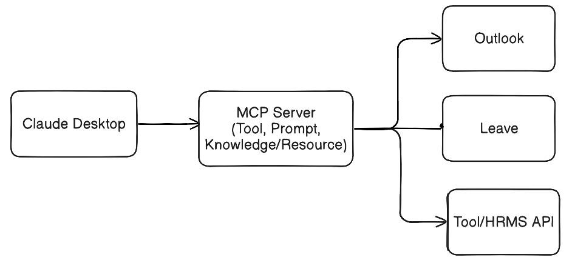
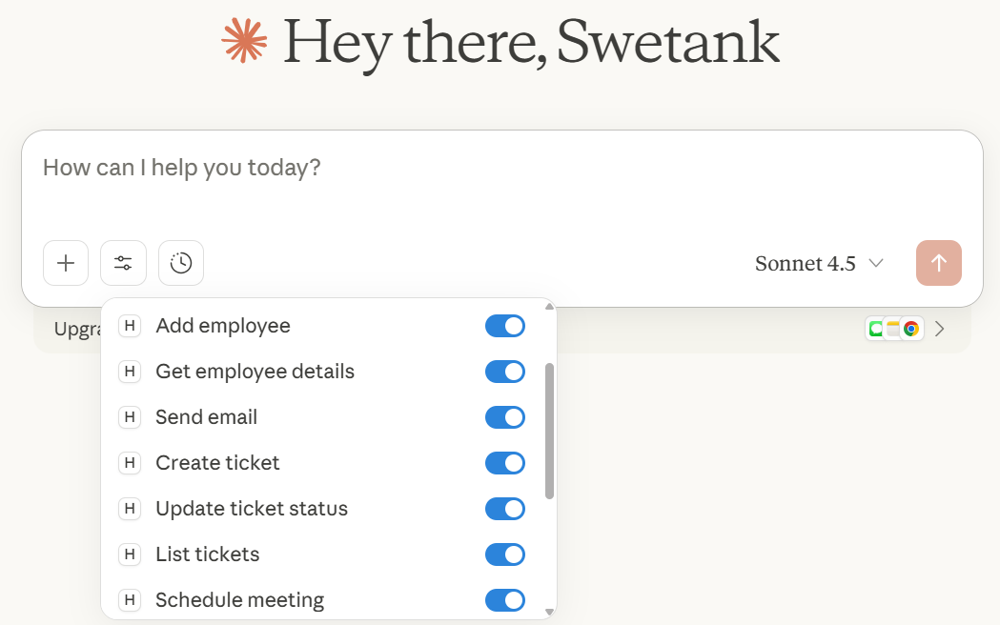
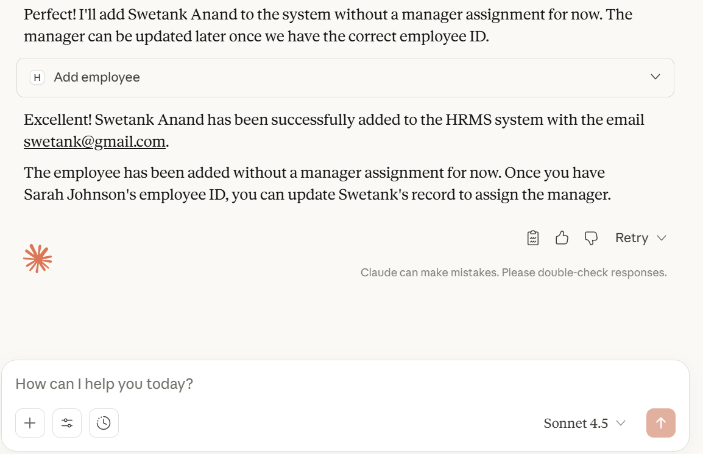
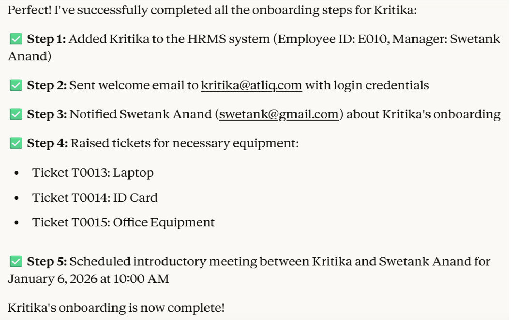

- Overview: HR Management System
  Our HRMS automates repetitive manual tasks for HR teams, such as scheduling welcome meetings creating employee profiles, submitting IT helpdesk requests, ordering laptops, and issuing ID cards—freeing up time for strategic work.

- Prerequisite installation
  - Claude Desktop (For setting refer at the end)
  - Install uv: powershell -ExecutionPolicy ByPass -c "irm https://astral.sh/uv/install.ps1 | iex"
  - HRMS folder for api integration
  - In cli of ide: uv add mcp[cli]
	- Update the details at 2 places pyproject.toml and uv.lock file

- Technical Architecture

- HR-Management-System Project Structure
  - hrms: Include all the api for HR management systems to perform task
  - resources: It includes all the resources needed like image, file, document etc.
  - utils.py: This file is use to seeds all the services means initilize all the require classes.
  - server.py: The file will interact with HRMS system, Emailing System, Databases etc and get things done via Claude Desktop client.

- HR Assist application
HR Assist Client Home Page

- HR Assist Response

- How to integrate Claude with code running:
  - Enable developer mode in Claude Desktop
  - Hamburger icon -> Developer -> Open app config -> Enter the details as below
{
    "mcpServers": {
        "hr-assist": {
            "command": "Path where uv.exe is available like \\.local\\bin\\uv",
            "args": [
                "--directory",
                "Path of the project",
                "run",
                "server.py"
            ],
            "env": {
                "EMAIL": "xyz@gmail.com",
                "EMAIL_PWD": "abcdefghi"
            }
        }
    }
}

- MCP Server has Tool, Prompt and Knowledge.
  - When we are defining sevices/action like send mail we use @mcp.tool()
  - When we are stiching together different services/activity then we use @mcp.prompt()

- Employee onboarding has completed successfully
